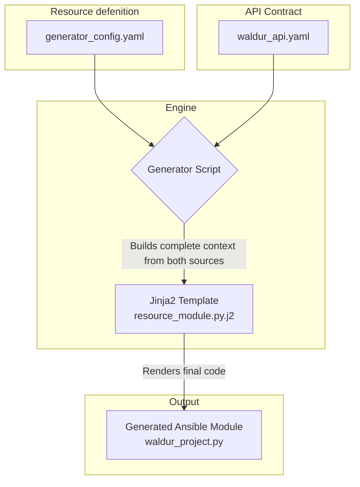
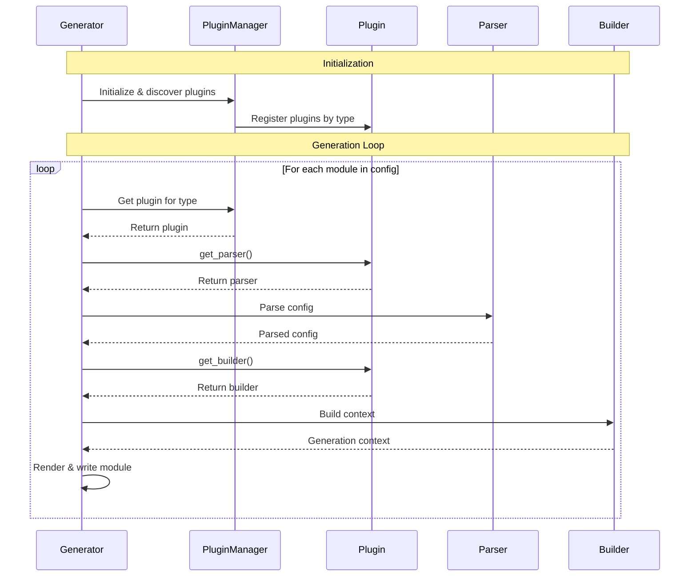

# Ansible Waldur Module Generator

This repository contains a Proof-of-Concept (PoC) for an Ansible Waldur module generator. It reads a standard OpenAPI specification and a lean generator configuration file to produce high-quality, idiomatic Ansible modules for managing resources via a Python Waldur SDK.

The generator is designed with a "Convention over Configuration" philosophy, allowing for extremely simple configuration for standard resources, while still providing a powerful advanced format for complex, non-standard cases.

## Key Features

-   **Plugin-Based Architecture**: The generator is fully extensible. New module types (`resource`, `action`, `facts`, etc.) can be added as self-contained plugins without modifying the core generator code.
-   **Entry Point Discovery**: Plugins are discovered automatically using Python's standard `importlib.metadata` entry points, allowing them to be distributed as separate packages.
-   **Schema-driven**: Automatically generates Ansible module parameters (name, type, choices, description, required status) from OpenAPI `requestBody` schemas.
-   **Smart Resolvers**: Automatically generates code to convert user-friendly names or UUIDs into API URLs.
-   **Strict Validation**: Fails early with clear, aggregated error messages if the configuration is inconsistent with the API specification.
-   **Automatic Documentation**: Generates the complete `DOCUMENTATION` and `EXAMPLES` sections in valid YAML format.

## Getting Started

### Prerequisites

-   Python 3.11+
-   [Poetry](https://python-poetry.org/docs/#installation) (for dependency management and running scripts)

### Installation

1.  Clone the repository:
    ```bash
    git clone <your-repo-url>
    cd ansible-waldur-generator
    ```

2.  Install the required Python dependencies using Poetry:
    ```bash
    poetry install
    ```
    This will create a virtual environment and install packages like `PyYAML`, `Jinja2`, and `Pytest`.

### Running the Generator

To generate the Ansible modules, run the `generate` script defined in `pyproject.toml`:

```bash
poetry run generate
```

By default, this command will:
-   Read `inputs/generator_config.yaml` and `inputs/waldur_api.yaml`.
-   Use the template from `generator/templates/`.
-   Place the generated file (`waldur_project.py`) into the `outputs/` directory.

You can customize the paths using command-line options:
```bash
poetry run generate --config my_config.yaml --output-dir ./dist
```
Run `poetry run generate --help` for a full list of options.

### Understanding the Generator Configuration

The `generator_config.yaml` file is the heart of the generator, where you define the modules you want to create.


**File: `inputs/generator_config.yaml`**
```yaml
modules:
  # The key 'project' is used for the module filename waldur_project.
  project:
    # This module type is is designed for standard resources that follow typical CRUD (Create-Read-Update-Delete) patterns. You define the resource and map standard actions to your SDK's `operationId`s.
    type: crud

    # The value is used for user-facing strings (e.g., in error messages).
    resource_type: project

    # Optional. If omitted, it will be auto-generated as "Manage Projects in Waldur."
    description: "Manage Projects in Waldur."

    # This mandatory block maps standard Ansible actions to your SDK's operationIds.
    operations:
       list: projects_list      # Used to check if the resource exists.
       create: projects_create  # Used when state=present and resource doesn't exist.
       destroy: projects_destroy  # Used when state=absent and resource exists.

    # This optional block defines how to resolve certain parameters from a
    # user-friendly name/UUID into an API URL, which is often required by the SDK.
    resolvers:
      # 'customer' is the name of the Ansible parameter to be resolved.
      customer:
        # The operationId used to find the resource by name.
        list: customers_list
        # The operationId used to find the resource by UUID (more efficient).
        retrieve: customers_retrieve
        # A user-friendly error message if the resource can't be found.
        error_message: "Customer '{value}' not found."
```

## Architecture

The generator's architecture is designed to decouple the Ansible logic from the API implementation details. It achieves this by using the `generator_config.yaml` as a "bridge" between the OpenAPI specification and the generated code.



### Plugin-Based Architecture


1. **Plugin Discovery**: The PluginManager uses Python's entry point system to automatically discover and register plugins at startup

2. **Separation of Concerns**:
   - Generator orchestrates the high-level workflow
   - PluginManager handles plugin discovery and registry
   - Each plugin encapsulates type-specific logic (parsing, building, templating)

3. **Plugin Contract**: All plugins implement the BasePlugin interface with three required methods, ensuring consistency

4. **Shared Resources**: The ApiSpecParser is used once and shared across all module generations

5. **Type-Agnostic Core**: The Generator doesn't need to know about specific module types - it delegates everything to the appropriate plugin

The diagram shows how the system processes each module definition through the plugin architecture, with clear handoffs between components and the plugin-specific processing that happens for each module type.




### Component Responsibilities

1.  **Core System (`generator.py`, `plugin_manager.py`)**:
    -   **`Generator`**: The main orchestrator. It knows nothing about specific module types like `resource` or `action`. Its only job is to manage the high-level workflow:
        1.  Initialize the `PluginManager`.
        2.  Parse the API spec once (using the shared `ApiSpecParser`).
        3.  Loop through the module definitions in `generator_config.yaml`.
        4.  For each definition, ask the `PluginManager` for the correct plugin based on the `type` key.
        5.  Delegate all subsequent parsing, building, and template selection to the returned plugin.
    -   **`PluginManager`**: The discovery service. On startup, it queries Python's packaging metadata for any installed packages that have registered themselves under the `ansible_waldur_generator.plugins` entry point. It loads these plugins and keeps a registry of which `type` string maps to which plugin object.

2.  **Plugin Interface (`plugins/base_plugin.py`)**:
    -   **`BasePlugin`**: An abstract base class that defines the "contract" every plugin must follow. It requires three methods:
        -   `get_parser()`: Must return a parser object responsible for understanding the plugin-specific sections of `generator_config.yaml`.
        -   `get_builder()`: Must return a builder object responsible for creating the final Jinja2 context for this plugin's template.

3.  **Concrete Plugins (e.g., `plugins/resource/`)**:
    -   Each plugin is a self-contained unit, typically a directory. It contains:
        -   **`parser.py`**: A subclass of `BaseConfigParser` that knows how to parse and validate the YAML configuration for its specific type (e.g., handling the `operations` and `resolvers` sections for a `resource` module).
        -   **`builder.py`**: A subclass of `BaseContextBuilder` that knows how to construct the final `GenerationContext` for its type.
        -   **`plugin.py`**: A small file that defines the main plugin class (e.g., `ResourcePlugin`) and associates it with `type` name. This class is what gets registered via the entry point.

### How to Add a New Plugin

This architecture makes adding support for a new module type straightforward and clean:

1.  **Create Plugin Directory**:
    Create a new directory: `generator/plugins/facts/`.

2.  **Implement Parser**:
    Create `generator/plugins/facts/parser.py` with a `FactsConfigParser` class. It will know how to parse the `facts`-specific YAML structure (e.g., `operation`, `return_key`, `identifier`).

3.  **Implement Builder**:
    Create `generator/plugins/facts/builder.py` with a `FactsContextBuilder` class. It will build the specific `FactsGenerationContext` needed by the `facts` template.

4.  **Create Template**:
    Create a new template file: `generator/templates/facts_module.py.j2`.

5.  **Register the Plugin**:
    Create `generator/plugins/facts/plugin.py`:
    ```python
    from ..base_plugin import BasePlugin
    from .parser import FactsConfigParser
    from .builder import FactsContextBuilder

    class FactsPlugin(BasePlugin):
        def get_type_name(self):
            return 'facts'

        def get_parser(self, ...):
            return FactsConfigParser(...)

        def get_builder(self, ...):
            return FactsContextBuilder(...)
    ```

6.  **Update Entry Points**:
    Add the new plugin to `pyproject.toml`:
    ```toml
    [tool.poetry.plugins."ansible_waldur_generator.plugins"]
    # ... existing plugins
    facts = "generator.plugins.facts.plugin:FactsPlugin"
    ```

After these steps, running `poetry install` will make the new `facts` type instantly available to the generator without any changes to the core `generator.py` or `plugin_manager.py` files.

## How to Use the Generated Modules

Once the generator has created the module files in the `outputs/` directory, you can use them immediately with Ansible just like any other module. There are two primary ways to run them: using an ad-hoc command for quick tests, or within a standard playbook.

### Prerequisites

Before running a module, you must tell Ansible where to find it. The simplest method is to set the `ANSIBLE_LIBRARY` environment variable to point to your output directory.

Execute this command from the root of your project. This setting will last for your current terminal session.

```bash
export ANSIBLE_LIBRARY=./outputs
```

Alternatively, you can create an `ansible.cfg` file in your project root with the following content:
```ini
[defaults]
library = ./outputs
```

### Method 1: Ad-Hoc Command (for Quick Testing)

The `ansible` ad-hoc command is perfect for testing a single module's functionality without writing a full playbook.

**Command Structure:**
```bash
ansible <host-pattern> -m <module_name> -a "<arguments>"
```

**Example: Getting Facts about an OpenStack Instance**

Let's assume you have generated a module named `waldur_marketplace_os_get_instance`. The following command will execute it against `localhost` to find an instance named `My Test VM` within the project `My Test Project`.

```bash
# Ensure ANSIBLE_LIBRARY is set first!
export ANSIBLE_LIBRARY=./outputs

# Run the ad-hoc command
ansible localhost -m waldur_marketplace_os_get_instance \
  -a "name='My Test VM' \
      project='My Test Project' \
      api_url='https://api.example.com/api/' \
      access_token='YOUR_SECRET_TOKEN'"
```

**Example Output (Success):**
```json
localhost | SUCCESS => {
    "changed": false,
    "instance": {
        "uuid": "a1b2c3d4-e5f6-...",
        "name": "My Test VM",
        "state": "OK",
        ...
    }
}
```

**Example from a Real Use Case:**

Here is a practical example showing how to find an instance named `mariak8s` inside a project identified by its UUID. Note how the arguments are passed as a single string.

```bash
ANSIBLE_LIBRARY=./outputs poetry run ansible localhost \
  -m waldur_marketplace_os_get_instance \
  -a "name='mariak8s' \
      project='39167edfe5cb4548b8193506c7488d42' \
      api_url='http://127.0.0.1:8000/api/' \
      access_token='YOUR_SECRET_TOKEN'"
```

> **Security Warning**: Passing `access_token` directly on the command line is insecure as it can be saved in your shell's history. This method is suitable for local development, but for production or shared environments, use Ansible Vault or environment variables as shown in the playbook method.

### Method 2: Playbook (for Standard Use)

This is the standard, recommended way to use Ansible modules for automation. It allows for more complex logic, better secret management, and version control.

**Step 1: Create a Playbook (`test_playbook.yml`)**

This playbook demonstrates how to call a generated `resource` module to ensure a project exists.

```yaml
- name: Test Generated Waldur Resource Module
  hosts: localhost
  connection: local
  gather_facts: false

  vars:
    # It is best practice to load secrets from a vault or environment variables
    waldur_api_url: "https://api.example.com/api/"
    waldur_access_token: "{{ lookup('env', 'WALDUR_ACCESS_TOKEN') }}"

  tasks:
    - name: Ensure a project named 'Ansible-Created Project' exists
      # Use the name of your generated module
      waldur_project:
        api_url: "{{ waldur_api_url }}"
        access_token: "{{ waldur_access_token }}"
        state: present
        name: "Ansible-Created Project"
        description: "A project managed by Ansible."
        customer: "Customer Name or UUID"
      register: project_info

    - name: Show the created or found project details
      ansible.builtin.debug:
        var: project_info.resource
```

**Step 2: Set Environment and Run**

Ensure `ansible.cfg` or `ANSIBLE_LIBRARY` is configured, then set the token as an environment variable and run the playbook.

```bash
# Set the secret token in the environment
export WALDUR_ACCESS_TOKEN='YOUR_SECRET_TOKEN'

# Run the playbook
ansible-playbook test_playbook.yml
```

**Example Output:**
```
PLAY [Test Generated Waldur Resource Module] ****************************

TASK [Ensure a project named 'Ansible-Created Project' exists] ********
changed: [localhost]

TASK [Show the created or found project details] ***********************
ok: [localhost] => {
    "project_info.resource": {
        "created": "...",
        "customer": "...",
        "description": "A project managed by Ansible.",
        "name": "Ansible-Created Project",
        "uuid": "f1g2h3i4-..."
    }
}

PLAY RECAP ***************************************************************
localhost                  : ok=2    changed=1    ...
```
