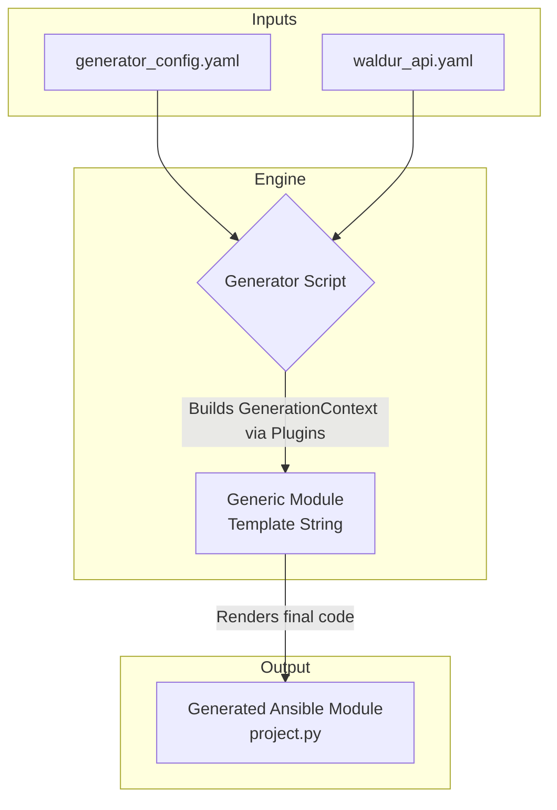
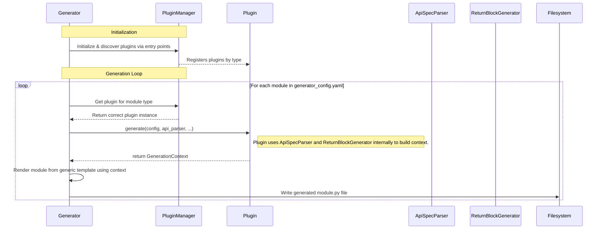

# Ansible Waldur Module Generator

This project is a code generator designed to automate the creation of a self-contained **Ansible Collection** for the Waldur API. By defining a module's behavior and its API interactions in a simple YAML configuration file, you can automatically generate robust, well-documented, and idempotent Ansible modules, perfectly packaged for distribution and use.

The primary goal is to eliminate boilerplate code, enforce consistency, and dramatically speed up the development process for managing Waldur resources with Ansible. The final output is an  Ansible Collection ready for publishing to **Ansible Galaxy**.

## Core Concept

The generator works by combining three main components:

1.  **OpenAPI Specification (`waldur_api.yaml`):** The single source of truth for all available API endpoints, their parameters, and their data models.
2.  **Generator Configuration (`generator_config.yaml`):** A user-defined YAML file where you describe the Ansible Collection and the modules you want to create. This is where you map high-level logic (like "create a resource") to specific API operations.
3.  **Plugins:** The engine of the generator. A plugin understands a specific workflow or pattern (e.g., fetching facts, simple CRUD, or complex marketplace orders) and contains the logic to build the corresponding Ansible module code.

## Getting Started

### Prerequisites

-   Python 3.11+
-   [Poetry](https://python-poetry.org/docs/#installation) (for dependency management and running scripts)
-   Ansible Core (`ansible-core >= 2.14`) for building and using the collection.

### Installation

1.  Clone the repository:
    ```bash
    git clone <your-repo-url>
    cd ansible-waldur-generator
    ```

2.  Install the required Python dependencies using Poetry:
    ```bash
    poetry install
    ```
    This will create a virtual environment and install packages like `PyYAML`, and `Pytest`.

### Running the Generator

To generate the Ansible Collection, run the `generate` script defined in `pyproject.toml`:

```bash
poetry run ansible-waldur-generator
```

By default, this command will:
-   Read `inputs/generator_config.yaml` and `inputs/waldur_api.yaml`.
-   Use the configured collection name (e.g., `waldur.cloud`) to create a standard Ansible Collection structure.
-   Place the generated collection into the `outputs/` directory.

The final structure will look like this:
```
outputs/
└── ansible_collections/
    └── waldur/
        └── cloud/
            ├── galaxy.yml
            ├── meta/
            │   └── runtime.yml
            └── plugins/
                ├── modules/
                │   └── project.py
                └── module_utils/
                    └── ...
```

You can customize the paths using command-line options:
```bash
poetry run generate --config my_config.yaml --output-dir ./dist
```
Run `poetry run ansible-waldur-generator --help` for a full list of options.

## The Plugin System

The generator uses a plugin-based architecture to handle different types of module logic. Each plugin is specialized for a common interaction pattern with the Waldur API. When defining a module in `generator_config.yaml`, the `type` key determines which plugin will be used.

The header defines Ansible collection namespace, name and version.

```yaml
collection:
  namespace: waldur
  name: cloud
  version: 1.0.0
```

Below is a detailed explanation of each available plugin.

---

### 1. The `facts` Plugin

-   **Purpose:** For creating **read-only** Ansible modules that fetch information about existing resources. These modules never change the state of the system and are analogous to Ansible's `_facts` modules (e.g., `setup_facts`).

-   **Workflow:**
    1.  The module's primary goal is to find and return resource data.
    2.  If the `many: true` option is set, the module returns a list of all resources matching the filter criteria.
    3.  If `many: false` (the default), the module expects to find a single resource. It will fail if multiple resources are found, prompting the user to provide a more specific identifier (like a UUID).
    4.  It can be configured with `context_params` (like `tenant` or `project`) to filter the search.

-   **Configuration Example (`generator_config.yaml`):**
    This example creates a `waldur_openstack_security_group_facts` module to get information about security groups within a specific tenant.

    ```yaml
    modules:
      openstack_security_group_facts:
        # 'type' tells the generator to use the 'facts' plugin.
        type: facts

        # User-friendly name for the resource, used in messages and docs.
        resource_type: "security group"
        description: "Get facts about OpenStack security groups."

        # The API operation to get a list of security groups.
        list_operation: "openstack_security_groups_list"

        # The API operation to get a single security group by its UUID.
        retrieve_operation: "openstack_security_groups_retrieve"

        # `many: true` allows the module to return a list of multiple security groups.
        # If this were false, finding more than one group would result in an error.
        many: true

        # `context_params` define additional parameters for filtering the search.
        context_params:
          - name: "tenant"
            description: "The name or UUID of the tenant to filter security groups by."
            # The resolver tells the generator how to convert the tenant's name/UUID
            # into the filter key needed by the 'openstack_security_groups_list' operation.
            resolver:
              list: "openstack_tenants_list"
              retrieve: "openstack_tenants_retrieve"
              # `filter_key` is the query parameter used in the `list_operation` call.
              filter_key: "tenant_uuid"
    ```

---

### 2. The `crud` Plugin

-   **Purpose:** For managing resources with **simple, direct, synchronous** API calls. This is ideal for foundational resources like customers or projects that have distinct `create`, `list`, and `destroy` endpoints and do not involve a complex provisioning process.

-   **Workflow:**
    -   **`state: present`**:
        1.  Calls the `list` operation to check if a resource with the given name already exists.
        2.  If it does not exist, it calls the `create` operation. `resolvers` are used to convert any foreign key names (e.g., a customer name) into the required API URLs.
        3.  If it exists, it does nothing.
    -   **`state: absent`**:
        1.  Calls the `list` operation to find the resource.
        2.  If it exists, it calls the `destroy` operation to remove it.

-   **Configuration Example (`generator_config.yaml`):**
    This example creates a `project` module for managing Waldur projects, showcasing resolvers for handling dependencies.

    ```yaml
    modules:
      # The key 'project' is used for the module filename project.
      project:
        # This module type is is designed for standard resources that follow typical
        # CRUD (Create-Read-Update-Delete) patterns. You define the resource and
        # map standard actions to your API's `operationId`s.
        type: crud

        # The value is used for user-facing strings (e.g., in error messages).
        resource_type: "project"

        # Optional. If omitted, it will be auto-generated as "Manage projects in Waldur."
        description: "Manage Projects in Waldur."

        # This mandatory block maps standard Ansible actions to your API's operationIds.
        operations:
          list: "projects_list" # Used to check if the resource exists.
          create: "projects_create" # Used when state=present and resource doesn't exist.
          destroy: "projects_destroy" # Used when state=absent and resource exists.

        # This optional block defines how to resolve certain parameters from a
        # user-friendly name/UUID into an API URL, which is often required by the API.
        resolvers:
          # 'customer' is the name of the Ansible parameter to be resolved.
          customer:
            # The operationId used to find the resource by name.
            list: "customers_list"
            # The operationId used to find the resource by UUID (more efficient).
            retrieve: "customers_retrieve"
            # A user-friendly error message if the resource can't be found.
            error_message: "Customer '{value}' not found."
    ```
---

### 3. The `order` Plugin

-   **Purpose:** The most powerful and specialized plugin, designed for resources managed through Waldur's **asynchronous marketplace order workflow**. This is the correct plugin for nearly all major cloud resources like VMs, volumes, databases, etc.

-   **Workflow:** This plugin encapsulates a complex, multi-step process:
    -   **`state: present`**:
        1.  Checks for the existence of the *final resource* (e.g., the volume) using `existence_check_op`.
        2.  If it **does not exist**, it creates a marketplace order via `marketplace_orders_create` and, if `wait: true`, polls for completion.
        3.  If it **does exist**, it checks if any fields in `update_check_fields` have changed and calls `update_op` to update the resource directly.
    -   **`state: absent`**:
        1.  Finds the existing resource.
        2.  Calls the standard `marketplace_resources_terminate` endpoint.

-   **Configuration Example (`generator_config.yaml`):**
    This example creates a `waldur_os_volume` module by migrating the original `waldur_marketplace_os_volume` logic.

    ```yaml
    modules:
      os_volume:
        # Use the 'order' plugin for the marketplace workflow.
        type: order

        description: "Create, update, or delete an OpenStack Volume via the marketplace."
        resource_type: "OpenStack volume"

        # Specifies the API call to check if the final volume exists.
        existence_check_op: "openstack_volumes_list"

        # (Optional) Specifies the API call to update an existing volume.
        update_op: "openstack_volumes_update"

        # (Optional) A list of parameters that trigger an update if changed.
        update_check_fields:
          - "description"

        # A list of parameters specific to this resource that go into the
        # nested 'attributes' dictionary of the order request.
        attribute_params:
          - name: size
            type: int
            required: true
            description: "The size of the volume in gigabytes (GB)."
          - name: type
            type: str
            description: "The name or UUID of the volume type (e.g., 'lvm', 'ssd')."
            # 'is_resolved: true' tells the builder that this parameter's value
            # must be resolved into a full API URL before being sent.
            is_resolved: true

        # Defines how to convert user-friendly names (like "Standard Volume")
        # into API URLs needed by the order request.
        resolvers:
          # This resolver is needed for the mandatory 'offering' parameter.
          offering:
            list: "marketplace_public_offerings_list"
            retrieve: "marketplace_public_offerings_retrieve"
            error_message: "Offering '{value}' not found."

          # This resolver is for the optional 'type' attribute.
          type:
            list: "openstack_volume_types_list"
            retrieve: "openstack_volume_types_retrieve"
            error_message: "Volume type '{value}' not found."
    ```

## Architecture

The generator's architecture is designed to decouple the Ansible logic from the API implementation details. It achieves this by using the `generator_config.yaml` as a "bridge" between the OpenAPI specification and the generated code.



### Plugin-Based Architecture

The system's flexibility comes from its plugin architecture. The `Generator` itself does not know the details of a `crud` module versus an `order` module. It only knows how to interact with the `BasePlugin` interface.

1.  **Plugin Discovery**: The `PluginManager` uses Python's entry point system to automatically discover and register plugins at startup.
2.  **Delegation**: The `Generator` reads a module's `type` from the config and asks the `PluginManager` for the corresponding plugin.
3.  **Encapsulation**: Each plugin fully encapsulates the logic for its type. It knows how to parse its specific YAML configuration, interact with the `ApiSpecParser` to get operation details, and build the final `GenerationContext` needed to render the module.
4.  **Plugin Contract**: All plugins implement the `BasePlugin` interface, which requires a central `generate()` method. This ensures a consistent interaction pattern between the `Generator` and all plugins.
5.  **Runtime Logic (Runners)**: Each plugin is paired with a `runner.py` file. This runner contains the actual Python logic that will be executed by the Ansible module at runtime. The `Generator` copies this runner into the collection's `plugins/module_utils/` directory, making the collection self-contained. The generated module is a thin wrapper that calls its corresponding runner.

The diagram below shows how the system processes each module definition.



### Component Responsibilities

1.  **Core System (`generator.py`, `plugin_manager.py`)**:
    -   **`Generator`**: The main orchestrator. It is type-agnostic. Its job is to:
        1.  Initialize the `PluginManager`.
        2.  Parse the API spec *once* using the shared `ApiSpecParser`.
        3.  Loop through module definitions.
        4.  For each definition, get the correct plugin from the `PluginManager`.
        5.  Call the plugin's `generate()` method, passing in the necessary tools like the config and API parser.
        6.  Take the returned `GenerationContext` and render the final module file.
        7.  Copy the plugin's associated `runner.py` file into `module_utils`.
    -   **`PluginManager`**: The discovery service. It finds and loads all available plugins registered under the `ansible_waldur_generator` entry point in `pyproject.toml`.

2.  **Plugin Interface (`interfaces/plugin.py`)**:
    -   **`BasePlugin`**: An abstract base class that defines the "contract" for all plugins. It requires two main methods:
        -   `get_type_name()`: Returns the string that links the plugin to the `type` key in the YAML config (e.g., `'crud'`).
        -   `generate()`: The main entry point for the plugin. It receives the module configuration and API parsers and is responsible for returning a complete `GenerationContext` object.

3.  **Concrete Plugins (e.g., `plugins/crud/`)**:
    -   Each plugin is a self-contained directory containing:
        -   **`config.py`**: A Pydantic model for validating the plugin-specific sections of `generator_config.yaml`.
        -   **`runner.py`**: The runtime logic for the generated Ansible module. This code is executed on the target host.
        -   **`plugin.py`**: The implementation of `BasePlugin` (e.g., `CrudPlugin`). This class orchestrates the plugin-specific logic for generating the module's documentation, parameters, and runner context.


### How to Add a New Plugin

This architecture makes adding support for a new module type straightforward:

1.  **Create Plugin Directory**:
    Create a new directory for your plugin, e.g., `ansible_waldur_generator/plugins/my_type/`.

2.  **Define Configuration Model**:
    Create `plugins/my_type/config.py` with a Pydantic model inheriting from `BaseModel` to define and validate the YAML structure for your new type.

3.  **Implement the Runner**:
    Create `plugins/my_type/runner.py`. Define a class (e.g., `MyTypeRunner`) that inherits from `BaseRunner` and implements the runtime logic for your module.

4.  **Implement the Plugin Class**:
    Create `plugins/my_type/plugin.py`:
    ```python
    from ansible_waldur_generator.interfaces.plugin import BasePlugin
    from ansible_waldur_generator.models import GenerationContext
    # Import your config model and other necessary components

    class MyTypePlugin(BasePlugin):
        def get_type_name(self) -> str:
            # This must match the 'type' key in the YAML config
            return 'my_type'

        def generate(self, module_key, raw_config, api_parser, ...) -> GenerationContext:
            # 1. Parse and validate raw_config using your Pydantic model.
            # 2. Use api_parser to get details about API operations.
            # 3. Build the argument_spec, documentation, examples, etc.
            # 4. Build the runner_context dictionary to pass runtime info to your runner.
            # 5. Return a fully populated GenerationContext object.
            return GenerationContext(...)
    ```

5.  **Register the Plugin**:
    Add the new plugin to the entry points section in `pyproject.toml`:
    ```toml
    [tool.poetry.plugins."ansible_waldur_generator"]
    # ... existing plugins
    crud = "ansible_waldur_generator.plugins.crud.plugin:CrudPlugin"
    order = "ansible_waldur_generator.plugins.order.plugin:OrderPlugin"
    facts = "ansible_waldur_generator.plugins.facts.plugin:FactsPlugin"
    my_type = "ansible_waldur_generator.plugins.my_type.plugin:MyTypePlugin" # Add this line
    ```

6.  **Update Poetry Environment**:
    Run `poetry install`. This makes the new entry point available to the `PluginManager`. Your new `my_type` is now ready to be used in `generator_config.yaml`.

After these steps, running `poetry install` will make the new `facts` type instantly available to the generator without any changes to the core `generator.py` or `plugin_manager.py` files.

## How to Use the Generated Collection

Once generated, the collection can be used immediately for local testing or packaged for distribution. End-users who are not developing the generator can skip directly to the "Installing from Ansible Galaxy" section.

### Method 1: Local Development and Testing

The most straightforward way to test is to tell Ansible where to find your newly generated collection by setting an environment variable.

1.  **Set the Collection Path:**
    From the root of your project, run:
    ```bash
    export ANSIBLE_COLLECTIONS_PATH=./outputs
    ```
    This command tells Ansible to look for collections inside the `outputs` directory. This setting lasts for your current terminal session.

2.  **Run an Ad-Hoc Command:**
    You can now test any module using its **Fully Qualified Collection Name (FQCN)**. This is perfect for a quick check.

    **Command:**
    ```bash
    # Test the 'waldur.cloud.project' module from the 'waldur.cloud' collection
    ansible localhost -m waldur.cloud.project \
      -a "state=present \
          name='My AdHoc Project' \
          customer='Big Corp' \
          api_url='https://api.example.com/api/' \
          access_token='YOUR_SECRET_TOKEN'"
    ```

    **Example Output (Success, resource created):**
    ```json
    localhost | CHANGED => {
        "changed": true,
        "resource": {
            "created": "2024-03-21T12:00:00.000000Z",
            "customer": "https://api.example.com/api/customers/...",
            "customer_name": "Big Corp",
            "description": "",
            "name": "My AdHoc Project",
            "url": "https://api.example.com/api/projects/...",
            "uuid": "a1b2c3d4-e5f6-7890-abcd-ef1234567890"
        }
    }
    ```

    **Example Output (Success, resource already existed):**
    ```json
    localhost | SUCCESS => {
        "changed": false,
        "resource": {
            "created": "2024-03-21T12:00:00.000000Z",
            "customer": "https://api.example.com/api/customers/...",
            "customer_name": "Big Corp",
            "description": "",
            "name": "My AdHoc Project",
            "url": "https://api.example.com/api/projects/...",
            "uuid": "a1b2c3d4-e5f6-7890-abcd-ef1234567890"
        }
    }
    ```

    > **Security Warning**: Passing `access_token` on the command line is insecure. For production, use Ansible Vault or environment variables as shown in the playbook method.

3.  **Use in a Playbook:**
    This is the standard and recommended way to use the collection for automation.

    **`test_playbook.yml`:**
    ```yaml
    - name: Manage Waldur Resources with Generated Collection
      hosts: localhost
      connection: local
      gather_facts: false
      # Good practice to declare the collection you are using
      collections:
        - waldur.cloud

      vars:
        waldur_api_url: "https://api.example.com/api/"
        waldur_access_token: "{{ lookup('env', 'WALDUR_ACCESS_TOKEN') }}"

      tasks:
        - name: Ensure 'My Playbook Project' exists
          # Use the FQCN of the module
          waldur.cloud.project:
            state: present
            name: "My Playbook Project"
            customer: "Big Corp"
            api_url: "{{ waldur_api_url }}"
            access_token: "{{ waldur_access_token }}"
          register: project_info

        - name: Show the created or found project details
          ansible.builtin.debug:
            var: project_info.resource
    ```

    **Run the playbook:**
    ```bash
    # Set the environment variables first
    export ANSIBLE_COLLECTIONS_PATHS=./outputs
    export WALDUR_ACCESS_TOKEN='YOUR_SECRET_TOKEN'

    # Run the playbook
    ansible-playbook test_playbook.yml
    ```

    **Example Output (Success):**
    ```
    PLAY [Manage Waldur Resources with Generated Collection] *************************

    TASK [Ensure 'My Playbook Project' exists] *************************************
    changed: [localhost]

    TASK [Show the created or found project details] *******************************
    ok: [localhost] => {
        "project_info.resource": {
            "created": "2024-03-21T12:05:00.000000Z",
            "customer": "https://api.example.com/api/customers/...",
            "customer_name": "Big Corp",
            "description": "",
            "name": "My Playbook Project",
            "url": "https://api.example.com/api/projects/...",
            "uuid": "a1b2c3d4e5f67890abcdef1234567890"
        }
    }

    PLAY RECAP *********************************************************************
    localhost                  : ok=2    changed=1    unreachable=0    failed=0    skipped=0    rescued=0    ignored=0
    ```


## Publishing and Installing

### Publishing to Ansible Galaxy

The generated output is ready to be published, making your modules available to everyone.

1.  **Build the Collection Archive:**
    Navigate to the root of the generated collection and run the build command. The output tarball will be placed in the parent directory.
    ```bash
    # Navigate to the actual collection directory
    cd outputs/ansible_collections/waldur/cloud/

    # Build the collection, placing the output tarball in the `outputs` directory
    ansible-galaxy collection build --output-path ../../../..
    ```
    This will create a file like `outputs/waldur-cloud-1.0.0.tar.gz`.

2.  **Get a Galaxy API Key:**
    -   Log in to [galaxy.ansible.com](https://galaxy.ansible.com/).
    -   Navigate to `Namespaces` and select your namespace.
    -   Copy your API key from the "API Key" section.

3.  **Publish the Collection:**
    Use the `ansible-galaxy` command to upload your built archive.
    ```bash
    # Set the token as an environment variable (note the correct variable name)
    export ANSIBLE_GALAXY_TOKEN="your_copied_api_key"

    # From the `outputs` directory, publish the tarball
    cd outputs/
    ansible-galaxy collection publish waldur-cloud-1.0.0.tar.gz
    ```

### Installing from Ansible Galaxy (for End-Users)

Once the collection is published, any Ansible user can easily install and use it.

1.  **Install the Collection:**
    ```bash
    ansible-galaxy collection install waldur.cloud
    ```

2.  **Use it in a Playbook:**
    After installation, the modules are available globally. Users can simply write playbooks referencing the FQCN.

    ```yaml
    - name: Create a Waldur Project
      hosts: my_control_node
      tasks:
        - name: Ensure project exists
          waldur.cloud.project:
            state: present
            name: "Production Project"
            customer: "Customer Name"
            api_url: "https://api.waldur.com/api/"
            access_token: "{{ my_waldur_token }}"
    ```
