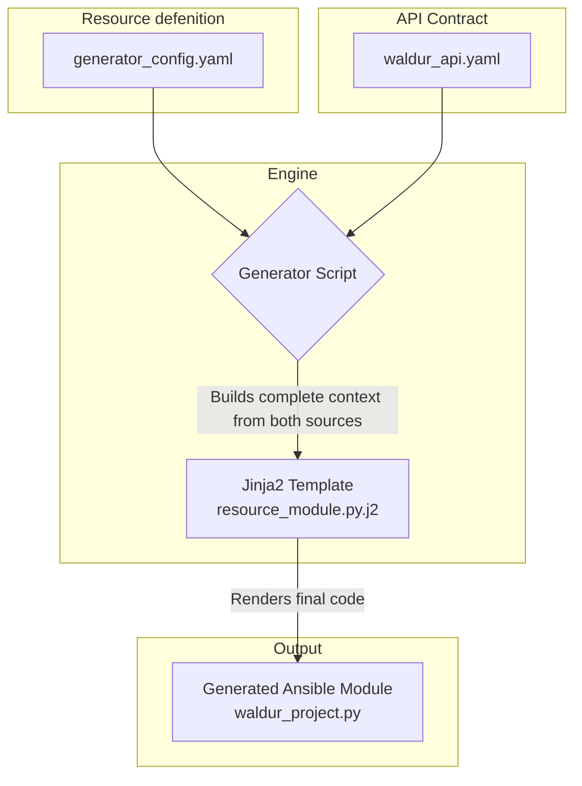
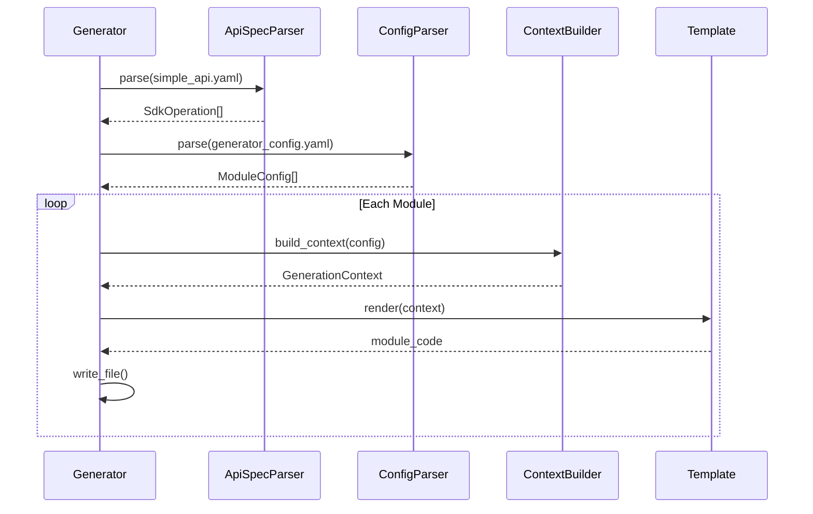

# Ansible Waldur Module Generator

This repository contains a Proof-of-Concept (PoC) for an Ansible Waldur module generator. It reads a standard OpenAPI specification and a lean generator configuration file to produce high-quality, idiomatic Ansible modules for managing resources via a Python Waldur SDK.

The generator is designed with a "Convention over Configuration" philosophy, allowing for extremely simple configuration for standard resources, while still providing a powerful advanced format for complex, non-standard cases.

## Key Features

-   **Clean Architecture**: Logic is separated into dedicated Parser, Builder, and Orchestrator components for maintainability and testability.
-   **Convention-driven**: Infers SDK module paths from OpenAPI `tags`.
-   **Schema-driven**: Automatically generates Ansible module parameters (name, type, choices, description, required status) from OpenAPI `requestBody` schemas.
-   **Smart Resolvers**: Automatically generates code to convert user-friendly names or UUIDs into API URLs, using efficient `retrieve` (for UUIDs) and `list` (for names) lookups.
-   **Strict Validation**: Fails early with clear error messages if the configuration is inconsistent with the API specification (e.g., a required resolver is missing).
-   **Type-safe**: Generates code that uses typed model classes from the SDK for request bodies.
-   **Conditional Code Generation**: Helper functions (like resolvers) are only added to the generated module if they are actually needed.
-   **Automatic Documentation**: Generates not just the module code, but also the complete `DOCUMENTATION` and `EXAMPLES` sections in valid YAML format.

## Getting Started

### Prerequisites

-   Python 3.8+
-   [Poetry](https://python-poetry.org/docs/#installation) (for dependency management and running scripts)

### Installation

1.  Clone the repository:
    ```bash
    git clone <your-repo-url>
    cd ansible-waldur-generator
    ```

2.  Install the required Python dependencies using Poetry:
    ```bash
    poetry install
    ```
    This will create a virtual environment and install packages like `PyYAML`, `Jinja2`, and `Pytest`.

### Running the Generator

To generate the Ansible modules, run the `generate` script defined in `pyproject.toml`:

```bash
poetry run generate
```

By default, this command will:
-   Read `inputs/generator_config.yaml` and `inputs/waldur_api.yaml`.
-   Use the template from `generator/templates/`.
-   Place the generated file (`waldur_project.py`) into the `outputs/` directory.

You can customize the paths using command-line options:
```bash
poetry run generate --config my_config.yaml --output-dir ./dist
```
Run `poetry run generate --help` for a full list of options.

### Understanding the Generator Configuration

The `generator_config.yaml` file is the heart of the generator, where you define the modules you want to create.

This format is designed for standard resources that follow typical CRUD (Create-Read-Update-Delete) patterns. You define the resource and map standard actions to your SDK's `operationId`s.

**File: `inputs/generator_config.yaml`**
```yaml
modules:
  # The key 'project' is used for the module filename waldur_project.
  project:
    # The value is used for user-facing strings (e.g., in error messages).
    resource_type: project
    
    # Optional. If omitted, it will be auto-generated as "Manage Projects in Waldur."
    description: "Manage Projects in Waldur."
    
    # This mandatory block maps standard Ansible actions to your SDK's operationIds.
    operations:
       list: projects_list      # Used to check if the resource exists.
       create: projects_create  # Used when state=present and resource doesn't exist.
       destroy: projects_destroy  # Used when state=absent and resource exists.

    # This optional block defines how to resolve certain parameters from a
    # user-friendly name/UUID into an API URL, which is often required by the SDK.
    resolvers:
      # 'customer' is the name of the Ansible parameter to be resolved.
      customer:
        # The operationId used to find the resource by name.
        list: customers_list
        # The operationId used to find the resource by UUID (more efficient).
        retrieve: customers_retrieve
        # A user-friendly error message if the resource can't be found.
        error_message: "Customer '{value}' not found."
```

## Architecture

The generator's architecture is designed to decouple the Ansible logic from the API implementation details. It achieves this by using the `generator_config.yaml` as a "bridge" between the OpenAPI specification and the generated code.



### Component Responsibilities




1.  **Inputs**:
    -   `generator_config.yaml`: The **single source of truth for logic**. Defines which modules to create, maps Ansible actions (`list`, `create`) to API `operationId`s, and configures special behaviors like resolvers.
    -   `simple_api.yaml`: The **single source of truth for data**. Defines API endpoints, `tags` (for SDK mapping), and `schemas` for request bodies, which determine the Ansible module's parameters.

2.  **`parser.py` (The Analyst)**:
    -   **`ApiSpecParser`**: Reads the OpenAPI spec and transforms every endpoint definition into a structured `SdkOperation` data object.
    -   **`ConfigParser`**: Reads the user's `generator_config.yaml`. It normalizes the simplified format into the advanced format and performs initial validation by cross-referencing the `operationId`s with the data provided by the `ApiSpecParser`. Its output is a list of clean, validated `ModuleConfig` objects.

3.  **`builder.py` (The Assembler)**:
    -   **`ContextBuilder`**: Takes a single, validated `ModuleConfig` object. Its job is to perform the "last mile" of data transformation, turning the abstract configuration into the concrete data needed by the template. This includes:
        -   Inferring Ansible parameter details (`type`, `required`, `choices`) from the `model_schema`.
        -   Performing deeper validation (e.g., checking that a field requiring a URL has a resolver).
        -   Collecting all necessary `import` statements for SDK functions and models.
        -   Building the Python data structures that will become the `DOCUMENTATION` and `EXAMPLES` YAML blocks.

4.  **`generator.py` (The Orchestrator)**:
    -   **`Generator`**: The main class that drives the process. It's a thin layer that:
        -   Initializes the parser and builder.
        -   Calls the parser to get the list of `ModuleConfig` objects.
        -   Loops through each `ModuleConfig`, creating a `ContextBuilder` for it.
        -   Calls the builder to get the final `GenerationContext`.
        -   Renders the Jinja2 template with the context.
        -   Writes the final module file to disk.

This architecture ensures that each component has a single, well-defined responsibility, making the system highly modular and testable.

